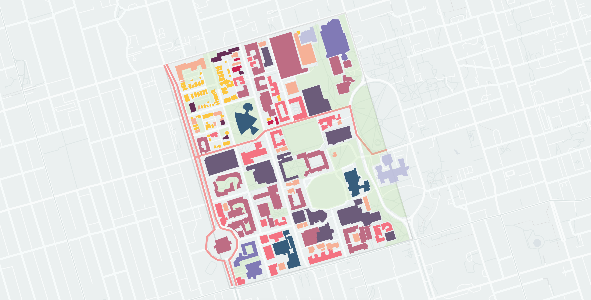

## Visual-UofT
Visualizing the "University" neighborhood via Kepler.GL

#### INSTRUCTIONS

The Kepler Config file can be found under the main repo directory as the file `keplergl.json`. You can feed this json directly into the Kepler.GL site to begin playing around with the data.

1. Navigate to the Kepler.GL demo website: http://kepler.gl/demo
2. Select the "Load Map using URL" tab.
3. Enter the following URL: `https://raw.githubusercontent.com/Karn/visual-uoft/master/keplergl.json`
4. Click/tap "Fetch" to load the map.

#### CONTRIBUTING
There are many ways to [contribute](./.github/CONTRIBUTING.md), you can
- submit bugs or improve the visualization,
- help track issues,
- review code changes.